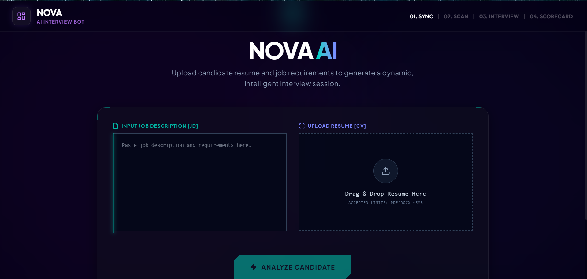
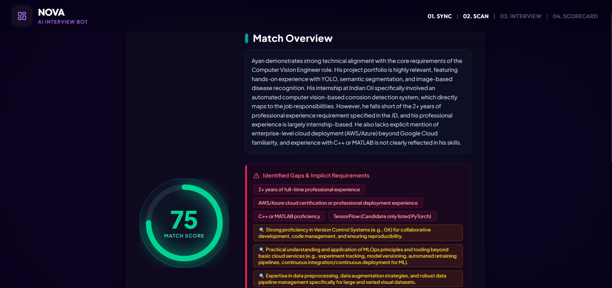
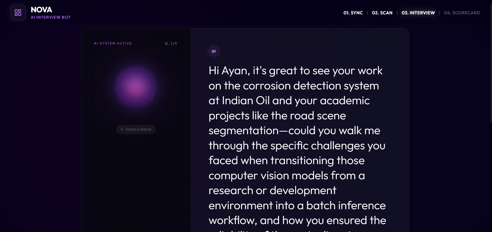
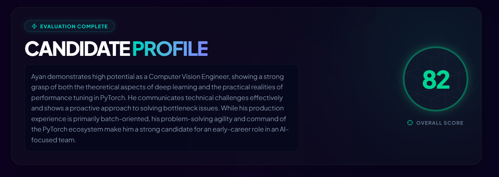
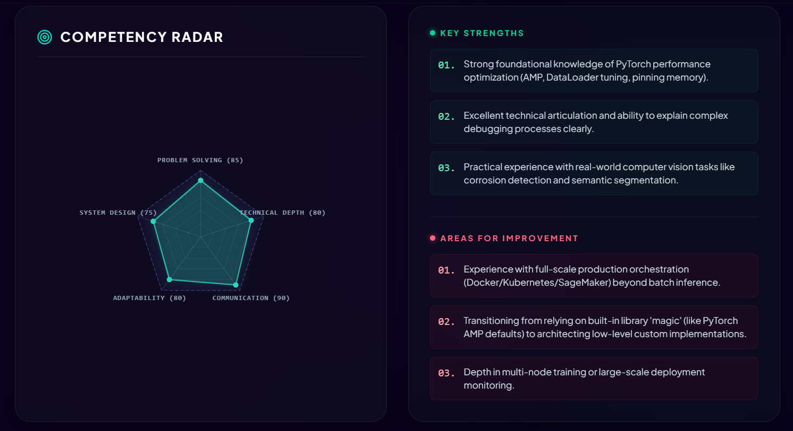
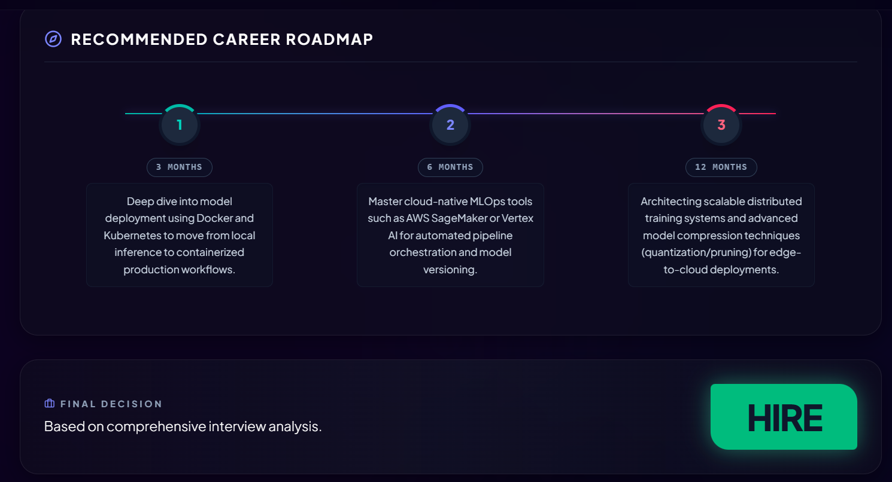

# NOVA AI 🌌 – Intelligent AI Interview Platform

<p align="center">
  
  
  
  
  
</p>

## Overview

**NOVA AI** is a next-generation, AI-driven interview intelligence platform designed to evaluate candidates through dynamic, real-time conversations rather than static questionnaires. It bridges the gap between traditional recruitment and intelligent candidate assessment by adapting to the candidate's experience and the specific requirements of the job.

Built for modern hiring teams, the system parses resumes, analyzes job descriptions, dynamically generates adaptive interview questions contextually suited for the candidate, evaluates their spoken answers in real time via Voice-to-Text, and ultimately provides a comprehensive technical scorecard.

---

## Key Features

- 📄 **Smart Resume (CV) & Job Description (JD) Parsing:** Uses advanced NLP (spaCy & pdfminer) to intelligently extract key skills, experiences, and requirements.
- 🎯 **Gap Analysis & Deep Research:** AI compares the CV against the JD to highlight missing skills and automatically researches the candidate’s domain to tailor the interview.
- 🎙️ **Interactive AI Voice Interviewer:** A sleek, futuristic interface where an AI bot asks dynamically generated questions. Candidates can respond via voice (Speech-to-Text).
- 🧠 **Adaptive Questioning:** The AI doesn't just read a script. It listens to the answer and generates contextual questions based on the candidate's actual responses.
- 📊 **Real-time Evaluation & Scorecard:** At the end of the interview, NOVA AI generates a detailed scorecard ranking the candidate on Technical Depth, Communication, Problem Solving, and System Design, complete with hiring recommendations.

---

## Tech Stack

### Frontend 
- **Framework:** React 19 + Vite
- **Styling:** Tailwind CSS v4, Framer Motion for smooth animations
- **Icons & UI:** Lucide React
- **Voice/Audio:** Web Speech API

### Backend 
- **Framework:** FastAPI
- **LLM Integration:** Google Generative AI (Gemini Pro) for question generation and evaluation
- **Document Parsing:** `pdfminer.six` (PDFs), `python-docx` (Word Documents)
- **NLP:** spaCy

---

## Getting Started

Follow these instructions to set up the project locally for development and testing.

### Prerequisites
- Node.js (v18+)
- Python (3.9+)
- A Google Gemini API Key

### 1. Clone the repository
```bash
git clone https://github.com/ayan0xdl/resume-parser-engine.git
cd resume-parser-engine
```

### 2. Backend Setup
```bash
cd backend
python -m venv venv
# On Windows
venv\Scripts\activate
# On macOS/Linux
source venv/bin/activate

# Install dependencies
pip install -r requirements.txt
python -m spacy download en_core_web_sm

# Environment Variables
# Create a .env file in the backend directory and add your API key:
# GEMINI_API_KEY=your_gemini_api_key_here
```

Run the backend server:
```bash
uvicorn main:app --reload --port 8000
```
*The backend will be running at `http://localhost:8000`*

### 3. Frontend Setup
Open a new terminal window:
```bash
cd frontend

# Install dependencies
npm install

# Environment Variables
# Create a .env file in the frontend directory and add the backend URL:
# VITE_API_URL=http://localhost:8000

# Run the development server
npm run dev
```
*The frontend will be running at `http://localhost:5173`*

---

## Screenshots


### 1. Upload Section
*Upload the JD and CV.*  


### 2. Match Insight
*Showing the deep research insights.*  


### 3. Active Interview
*The interface with NOVA bot.*  


### 4. Scorecard
*Final evaluation scorecard and candidate recommendations.*  
  
  


---

## Future Improvements

- [ ] Connect with Applicant Tracking Systems (ATS) downstream.
- [ ] Add Multi-language support for global technical interviews.
- [ ] Implement Speech-to-Speech interaction (TTS for the interviewer voice).
- [ ] Add facial sentiment analysis during the interview to track confidence.